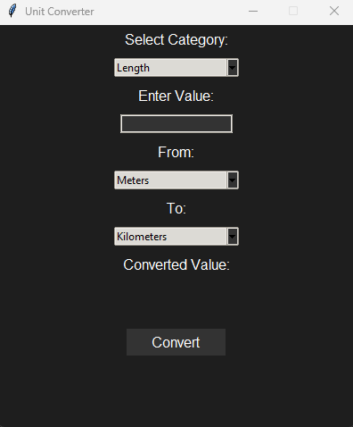

# Unit Converter

A **Python-based Unit Converter** with a GUI interface built using **Tkinter**. This app allows users to easily convert between various units across multiple categories, including Length, Weight, Temperature, and more.

---

## Features

- **Categories Supported**: 
  - Length (Meters, Kilometers, Miles, Feet)
  - Weight (Kilograms, Pounds, Grams, Ounces)
  - Temperature (Celsius, Fahrenheit, Kelvin)
  - [Add more categories as needed!]

- **User-Friendly Interface**: 
  - Clean design with dropdown menus for category and units.
  - Easy-to-read result display.

- **Real-Time Conversion**:
  - Converts values instantly after selection.

---

## Screenshots

  
*(Add an actual screenshot of your app here.)*

---

## Requirements

- **Python 3.7+**
- Required Python libraries:
  - `tkinter` (comes pre-installed with Python)

---

## Setup and Usage

1. Clone the repository:
   ```bash
   git clone https://github.com/Jatly/UnitConverter.git
   cd UnitConverter
